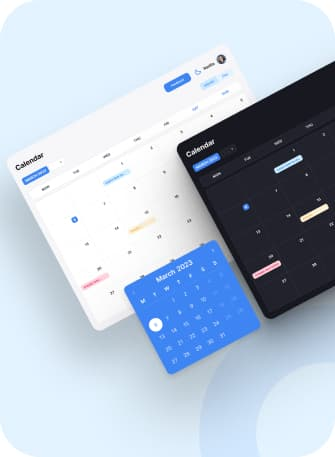
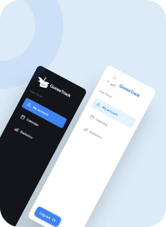
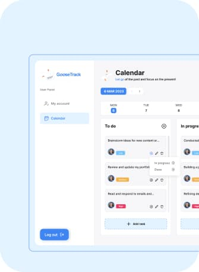

#### 
[UA](README.md)

# 
Welcome to "GooseTrack" 

  

  
  

## Contents

- [Description](#description)
- [Technologies Used](#technologies-used)
- [How to Use "Goose Track"](#usage)

## Description

The GooseTrack application is a powerful tool for task planning, workflow
management, and personal productivity tracking. Add and manage tasks, mark them
as completed, view your schedule, and analyze statistics to achieve maximum
efficiency.

## Technologies Used

- `React`: Used for building user interfaces and creating components.

- `Redux` and `React-Redux`: Used for state management and integration with
  React.

- `Redux Persist`: Used for saving Redux state to local storage.

- `reduxjs/toolkit`: A set of utilities for simplifying Redux-related tasks.

- `React Router` and `React Router DOM`: Used for routing and navigation between
  app pages.

- `Axios`: Used for making HTTP requests to the server.

- `Formik` and `Yup`: Used for creating and validating forms.

- `Styled Components`: A library for writing CSS styles at the component level.

- `Recharts`: A library for creating charts and diagrams.

- `React Modal`: A library for creating modal windows.

- `React Slick`: A library for creating sliders.

- `Moment`: Used for working with dates and times.

- `Notiflix`: A library for displaying user notifications.

- `Tailwind CSS`: A CSS framework for rapid styling.

---

## Usage

1. Registration or Login: If you already have an account, log in. If not, create
   a new account to access all the app's features.

2. Main Dashboard: After logging in, you'll land on the main dashboard. Here,
   you can perform the following actions:

- Create Tasks.

- View a task calendar, where tasks are displayed by dates. Click on a specific
  day to see tasks scheduled for that day.

- Statistics: Select the relevant section to view statistics of your activity.
  You can see the number of completed tasks over a specific period of time.

- Settings: Change the theme, avatar, and add your own contact information.
  ***

Leave your feedback about the app. Rate the functionality and features you use.
Let your task management app help you plan, achieve goals, and organize your
day!

---

### Project "Goose Track" Backend:

###### ["Goose Track - Backend" ](https://github.com/IG00RA/project-team_5_backend)

---

### Swagger Documentation for "Goose Track" Project:

###### ["Goose Track - Swagger" ](https://project-team-5-backend.onrender.com/api-docs/)

---

### Contributors to the "Goose Track" Project:

