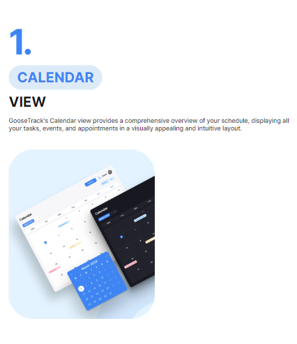

# 
Ласкаво просимо в "GooseTrack" 

## Вміст

- [Опис](#опис)
- [Технології](#технології)
- [Як користуватись "Goose Track"?](#інструкція)

## Опис

Додаток GooseTrack є потужним інструментом для планування завдань, керування
робочим процесом та відстеження особистої продуктивності. Додавайте та керуйте
завданнями, відзначайте їх виконання, переглядайте графік та аналізуйте
статистику для досягнення максимальної ефективності.

## Технології

- `React`: використовується для розробки інтерфейсу користувача та побудови
  компонентів.

- `Redux` та `React-Redux` : для управління станом додатка та зв'язку з React.

- `Redux Persist`: для збереження стану Redux у локальному сховищі.

- `reduxjs/toolkit`: набір утиліт для спрощення роботи з Redux.

- `React Router` та `React Router DOM`: для маршрутизації та навігації між
  сторінками додатка.

- `Axios`: використовується для здійснення HTTP-запитів на сервер.

- `Formik` та `Yup`: для створення та валідації форм.

- `Styled Components`: бібліотека для написання CSS-стилів на рівні компонентів.

- `Recharts`: бібліотека для створення графіків та діаграм.

- `React Modal`: бібліотека для створення модальних вікон.

- `React Slick`: бібліотека для створення слайдерів.

- `Moment`: для роботи з датами та часом.

- `Notiflix`: бібліотека для відображення повідомлень користувачу.

- `Tailwind CSS`: CSS-фреймворк для швидкої розробки стилів.

---

## Інструкція

1. Реєстрація або Вхід: Якщо ви вже маєте обліковий запис, увійдіть. Якщо ні,
   створіть новий обліковий запис, щоб отримати доступ до всіх функцій додатка.

2. Головна Панель: Після входу ви потрапите на головну панель. Тут ви зможете
   здійснити наступні дії:

- Створення Задач.

- Перегляд календарю задач, де задачі відображаються за датами. Клацніть на
  конкретний день, щоб побачити задачі, заплановані на цей день.

- Статистика: Виберіть відповідний розділ, щоб переглянути статистику вашої
  активності. Ви можете побачити кількість виконаних задач за певний період
  часу.

- Налаштування: змініть тему, аватарку, додати власну контактну інформацію.
  ***

Залишайте свої враження про додаток. Оцінюйте функціонал та фічі, які ви
використовуєте. Нехай ваш додаток для керування задачами допомагає вам у
плануванні, досягненні цілей та організації вашого дня!

---

### Бекенд проєкту "Goose Track":

###### ["Goose Track - Backend" ](https://github.com/IG00RA/project-team_5_backend)

---
<<<<<<< HEAD
=======

### Swagger документація до проєкту "Goose Track":

###### ["Goose Track - Swagger" ](https://project-team-5-backend.onrender.com/api-docs/)

---

### Над проектом "Goose Track" працювали:

>>>>>>> 17dc657ba20e530712f8cfe9d9cd5fa9211057aa
